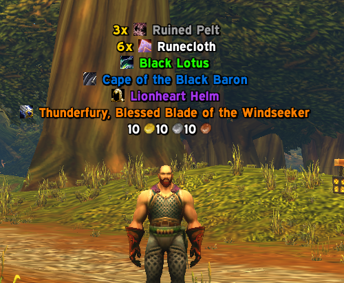
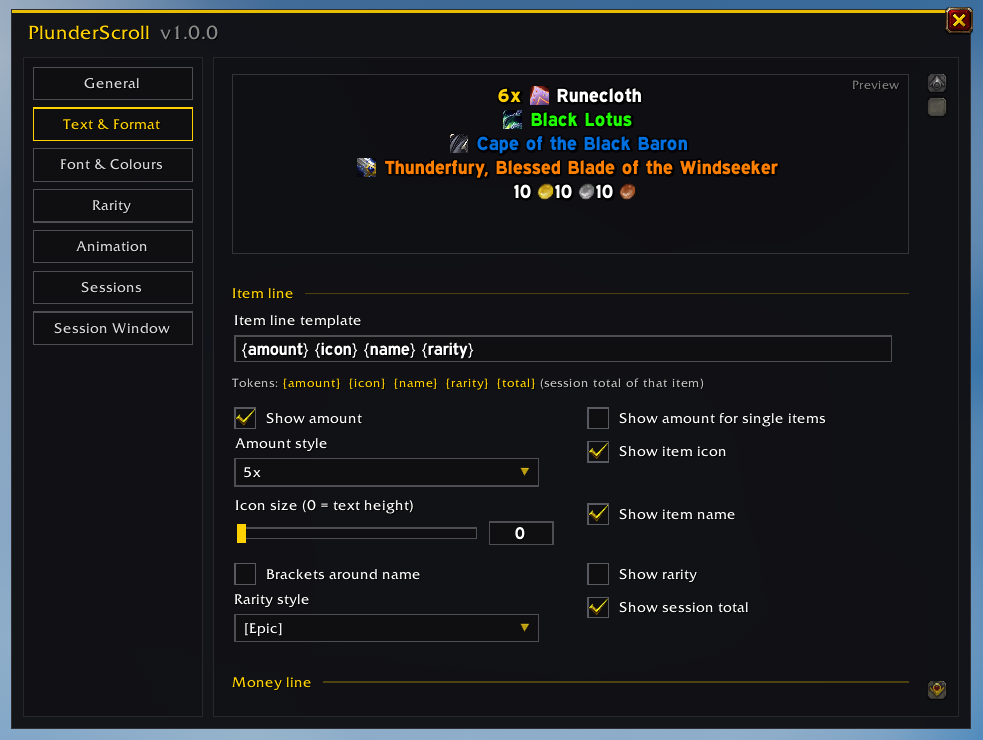
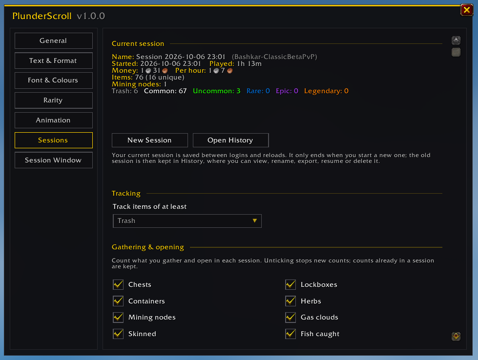
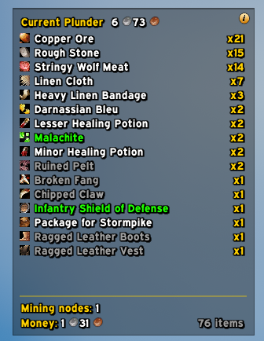

# PlunderScroll

**Scrolling loot text and loot sessions for WoW Forever.**

PlunderScroll shows everything you loot as clean, customisable scrolling text and keeps a running tally of each farming session. You can see how much you've plundered, what it's worth and how many nodes, chests and beasts it took to get there.

---

## Features

### Scrolling loot text
- Items and money float up (or down) the screen as you loot them, with item icons, rarity colours and coin icons.
- **Scroll** mode sends lines travelling and fading out, and **Stack** mode piles them up instead.
- Loot of the same item within a couple of seconds is merged into one line ("6x Runecloth" instead of six lines).
- You choose what scrolls: items, money, quest rewards, crafted items, and which rarities.

### Your line, your way
Build the loot line from a simple template such as `{amount} {icon} {name} {rarity} {total}`, then fine-tune every part of it. A live preview shows each change as you make it.

- Amount style (`5x`, `x5`, `+5`, `5`), icon size, brackets, rarity labels and session totals
- Any font from the game, from LibSharedMedia (EllesmereUI, ElvUI, SharedMedia, Details!, Plater, ...) or from your own font file path
- Colours, outline, shadow, size, direction, curve, speed, fade and more
- Rename and recolour the rarities themselves

### Loot sessions that survive logouts
Your current session is saved between logins and reloads. It only ends when you start a new one, so a farming run can span as many play sessions as you like. Each session tracks:

- Every item looted, with counts, and money looted
- Play time and gold per hour
- Loot by rarity
- **Gathering and opening counts**: chests, lockboxes, containers, herbs, mining nodes, gas clouds, skinned beasts, fish caught, pickpockets, disenchants, prospects and mills. Each one can be switched on or off.

### Session window
A small see-through window shows the current session at a glance: every item and its count, the **total value of your loot**, gathering counts, money and item total.

- **Item value** counts each item at its vendor price or its auction house price, whichever is higher. Auction prices come from **Auctionator** or **TradeSkillMaster** if you have one installed.
- Sort by amount, rarity, name or most recently looted, and hide low rarities.
- Click-through while locked, so it never gets in the way. Hold **Shift** to drag or resize it.
- Scroll the list with the mouse wheel when it doesn't all fit.
- Change its size, scale, font size, spacing and background opacity.

### History
Finished sessions are kept in the History window, per character. You can browse, search, filter and sort their items, rename sessions, resume an old one, export one as text or delete it.

---

## Getting started

1. Install PlunderScroll into `World of Warcraft\_classic_\Interface\AddOns\` (or your WoW Forever client's `Interface\AddOns` folder).
2. Log in and loot something.
3. Type **`/ps`** to open the settings, or **`/ps test`** to see some sample loot.

To move the scrolling text, type `/ps unlock`, drag the highlighted area where you want it, then type `/ps lock`.

You can also open PlunderScroll from the **addon compartment** on the minimap or from any **LibDataBroker** display (Titan Panel, ChocolateBar, ElvUI datatexts, ...). Left-click opens the settings and right-click opens History.

## Commands

| Command | What it does |
| --- | --- |
| `/ps` | Open the settings |
| `/ps history` | Open the session History |
| `/ps new [name]` | Archive the current session and start a new one |
| `/ps stats` | Print the current session's totals to chat |
| `/ps window` | Show or hide the session window |
| `/ps test` | Show sample loot (never counted in your session) |
| `/ps lock` / `/ps unlock` | Lock or move the scrolling text area |
| `/ps reset` | Put the scrolling text area back in its default position |

`/plunder` and `/plunderscroll` work too.

## FAQ

**Does the scrolling text change what gets tracked?**
No. What scrolls and what's tracked are separate settings. You can hide grey items from the scrolling text and still count them in your session, or the other way round.

**Where is my data saved?**
In WoW's SavedVariables (`PlunderScrollDB`), per character. Nothing leaves your computer.

**Why is the item value lower than I expected?**
Without an auction addon, items are valued at vendor price. Install Auctionator or TradeSkillMaster and scan the auction house to include auction prices. Soulbound items that can't be sold count as 0.

**My font isn't in the list.**
Fonts from other addons appear once that addon has loaded. Click **Rescan Fonts** on the Font & Colours page, or add the font by its file path on the same page.

---

Made by Ludde. Bug reports and suggestions are welcome in the GitHub issues.
